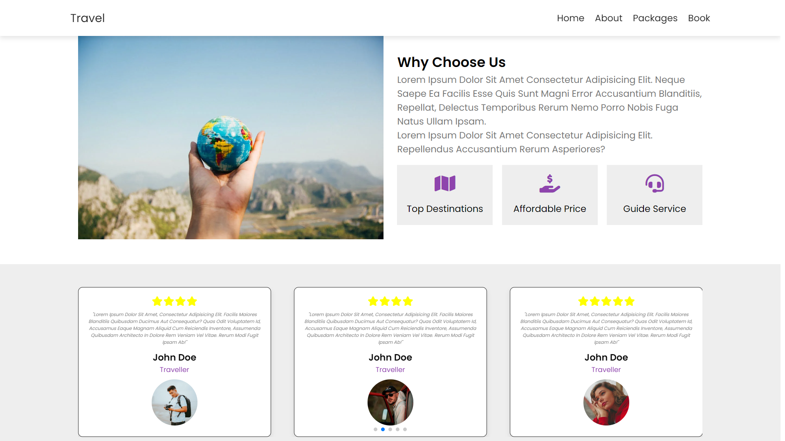
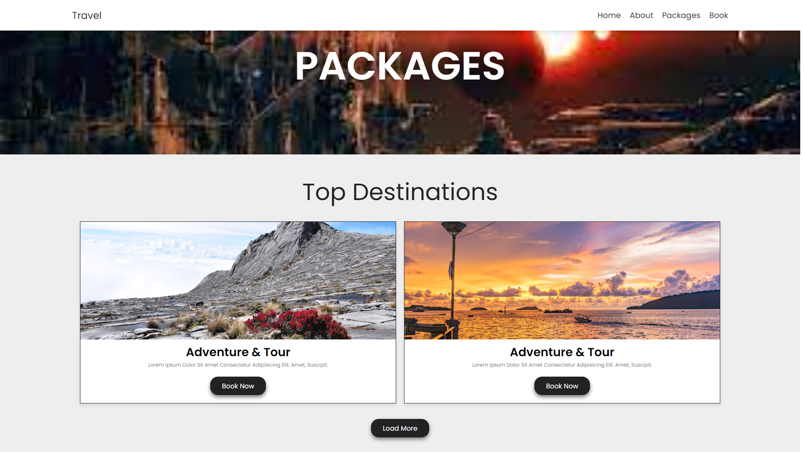
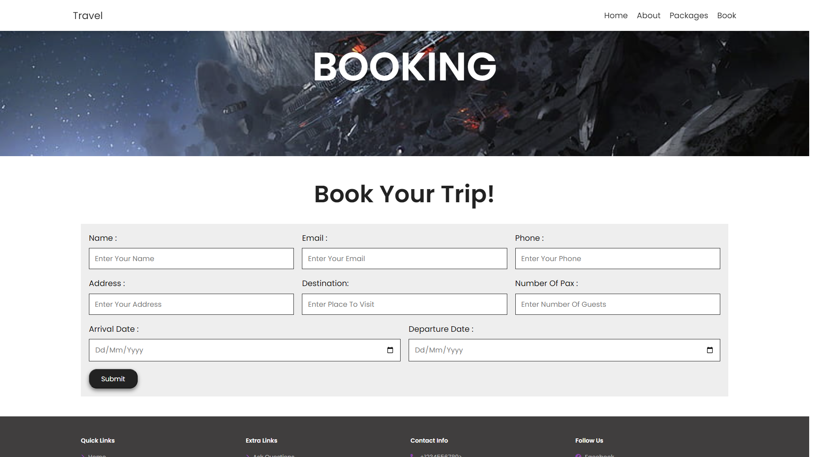

# Travel & Tour Web App

## Overview

This is a Travel & Tour web application that allows users to book trips. The application features a form for users to submit their booking details, which are then stored in a MySQL database. It is built using PHP and MySQL.

## Features

- User-friendly booking form
- Input validation and sanitization
- Data storage in MySQL

## Technologies Used

- **Frontend**: HTML, CSS, JavaScript
- **Backend**: PHP
- **Database**: MySQL

## Getting Started

### Prerequisites

- PHP (>= 7.0)
- MySQL (>= 5.7)
- A web server (e.g., Apache or Nginx)

### Installation

1. **Clone the Repository**

   ```bash
   git clone https://github.com/yourusername/travel-site.git
   cd travel-site
   ```

2. **Set Up the Database**

   - Create a new MySQL database.
   - Import the provided SQL schema to create the required tables.

   ```sql
   -- Example SQL to create table
   CREATE TABLE YOUR_TABLE_NAME (
       id INT AUTO_INCREMENT PRIMARY KEY,
       name VARCHAR(255) NOT NULL,
       email VARCHAR(255) NOT NULL,
       phone VARCHAR(20),
       address TEXT,
       destination VARCHAR(255),
       pax INT,
       arrival DATE,
       departure DATE
   );
   ```

3. **Configure Database Credentials**

   - Create `config.php` and update the MySQL credentials to match your local setup.

   ```php
   $servername = "localhost";
   $username = "YOUR_USERNAME";
   $password = "YOUR_PASSWORD";
   $database = "YOUR_DATABASE_NAME";
   $table = "YOUR_TABLE_NAME";
   ```

## Usage/Screen

1. **Home Page:**
 
   
   
      
3. **About Page:**
   
   

      
4. **Packages Page:**
   
   
   
   
6. **Booking Page:**
   - **Access the Booking Form**
      Navigate to `book_form.php` to view and use the booking form.

   - **Submit a Booking**
     Fill out the form with your details and click "Submit". The data will be processed and stored in the MySQL database.
     
    


## Contributing

Feel free to open issues or submit pull requests if you find any bugs or have suggestions for improvements.

## License

This project is licensed under the MIT License - see the [LICENSE](LICENSE) file for details.

## Contact

For any questions or support, please contact [me](mailto:md.ameynuddin@gmail.com).
